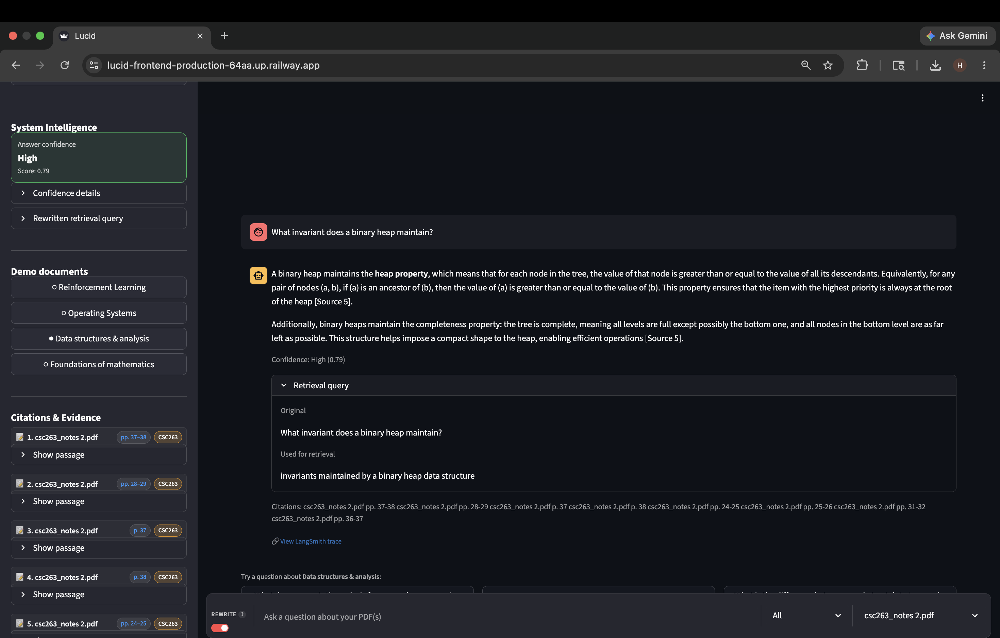
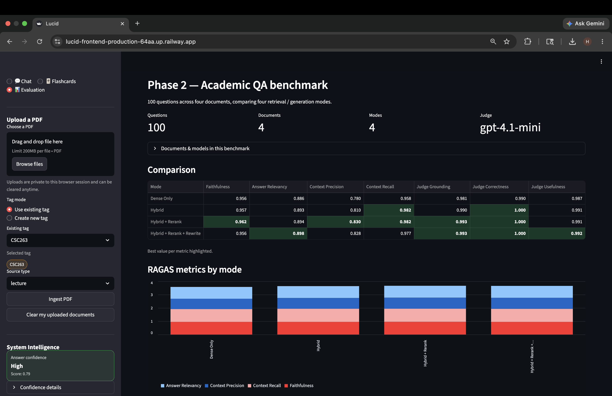
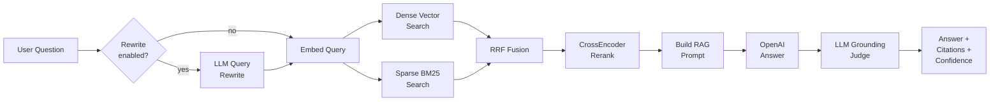
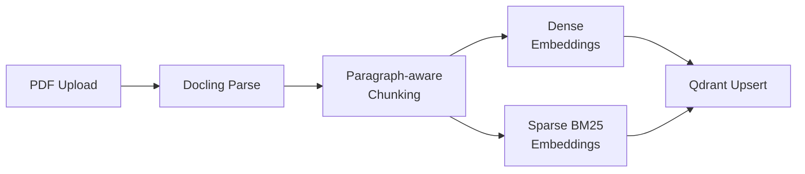
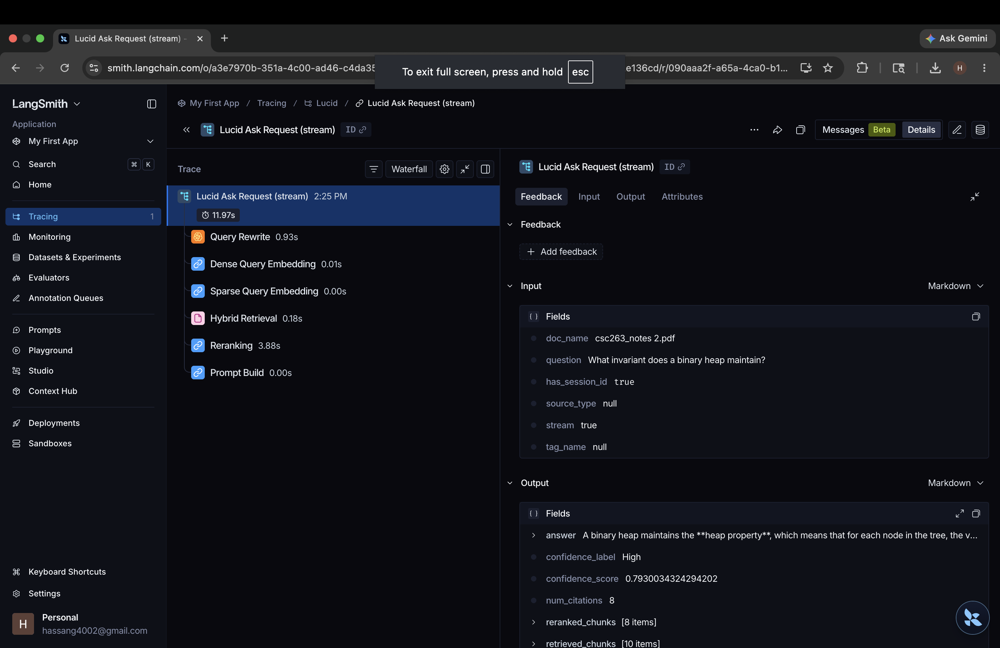

# Lucid

[](https://fastapi.tiangolo.com/)
[](https://streamlit.io/)
[](https://qdrant.tech/)
[](https://platform.openai.com/)
[](https://www.docker.com/)
[](https://www.langchain.com/langsmith)
[](https://github.com/explodinggradients/ragas)
[](https://www.python.org/)

Lucid is a production-style RAG system for grounded Q&A over academic PDFs. Hybrid dense + sparse retrieval, CrossEncoder reranking, and citation-grounded generation, measured on a 100-question benchmark using RAGAS metrics and a custom OpenAI LLM-as-judge. Async FastAPI backend, Streamlit frontend, Qdrant vector store, and end-to-end observability via LangSmith.

> **Live demo:** deploying to Railway — see [Roadmap](#roadmap).

<!--
Screenshot 1: Q&A view with citations.
To add: place image at docs/screenshots/qa-view.png and replace this comment with:

-->

## What This Demonstrates

- **End-to-end RAG architecture, not a chatbot wrapper.** Ingestion (Docling parsing, paragraph-aware token chunking), retrieval (dense MiniLM + BM25 sparse fused with Reciprocal Rank Fusion), reranking (CrossEncoder), and generation (OpenAI `gpt-4.1-mini`) built as separable, testable components.
- **Measured retrieval quality on a hand-built benchmark.** 100-question academic QA dataset across 4 real textbooks and course notes, scored with RAGAS (Faithfulness, Answer Relevancy, Context Precision, Context Recall) plus a custom OpenAI LLM-as-judge (Grounding, Correctness, Usefulness).
- **Production-grade service posture.** Async FastAPI with model preload at startup, CrossEncoder warmup, request timeouts, per-call OpenAI timeouts, SlowAPI rate limits, `/metrics` and `/healthz`, multi-worker Uvicorn, and CORS controls.
- **Transparent, inspectable answers.** Each answer ships with citations, page numbers, retrieved chunks, retrieval and rerank scores, an LLM grounding judge, and — when LangSmith is enabled — a per-answer trace URL.
- **Multi-tenant demo without auth.** Public preloaded documents alongside per-anonymous-session private uploads with 24-hour TTL cleanup — visible to the uploader, invisible to other anonymous users.

## Evaluation

### Dataset

Lucid is evaluated on a hand-curated 100-question benchmark across four real academic documents:

| Document | Questions |
|---|---:|
| *Reinforcement Learning: An Introduction* (Sutton & Barto) | 30 |
| *Operating Systems: Three Easy Pieces* | 30 |
| *CSC263 Data Structures and Analysis* (course notes) | 25 |
| *MAT102 Introduction to Mathematical Proofs* (course notes) | 15 |

- **Difficulty distribution:** 72 medium, 18 easy, 10 hard.
- **Question type distribution:** 40 conceptual, 33 comparison, 18 factual, 9 synthesis.
- Every example includes a hand-authored ground-truth answer plus an expected source hint.

### Methodology

Two complementary scoring stacks per example:

- **RAGAS metrics** — Faithfulness, Answer Relevancy, Context Precision, Context Recall.
- **Custom OpenAI LLM-as-judge** (`gpt-4.1-mini`) — Grounding, Correctness, Usefulness, each scored 0–1 with a brief written explanation.

Four retrieval/generation modes compared head-to-head on the same 100 examples:

1. **Dense Only** — SentenceTransformers MiniLM, top-k cosine.
2. **Hybrid** — Dense + BM25, fused with Reciprocal Rank Fusion.
3. **Hybrid + Rerank** — Hybrid candidates reranked with a CrossEncoder.
4. **Hybrid + Rerank + Query Rewrite** — Same as above, with an LLM-rewritten retrieval query.

### Results

| Mode | Faithfulness | Answer Relevancy | Context Precision | Context Recall | Judge Grounding | Judge Correctness | Judge Usefulness |
|---|---:|---:|---:|---:|---:|---:|---:|
| Dense Only | 0.956 | 0.886 | 0.780 | 0.958 | 0.981 | 0.990 | 0.987 |
| Hybrid | 0.957 | 0.893 | 0.810 | 0.982 | 0.990 | 1.000 | 0.991 |
| Hybrid + Rerank | **0.962** | 0.894 | **0.830** | **0.982** | **0.993** | **1.000** | 0.991 |
| Hybrid + Rerank + Rewrite | 0.956 | **0.898** | 0.828 | 0.977 | 0.993 | **1.000** | **0.992** |

<!--
Screenshot 2: In-app Evaluation page.
To add: place image at docs/screenshots/eval-page.png and replace this comment with:

-->

### Takeaway

Hybrid retrieval improves recall over dense-only retrieval. CrossEncoder reranking improves Faithfulness and Context Precision. Query rewriting nudges Answer Relevancy higher but trades a hair of Faithfulness. **The best overall measured configuration is Hybrid + Rerank**, which is what runs in production by default.

The production reranker is the smaller `cross-encoder/ms-marco-MiniLM-L-6-v2` (chosen for lower latency and memory vs the larger Electra variant). A judge-only recheck under MiniLM held at Grounding 0.992–0.995, Correctness 0.999–1.000, Usefulness 0.993–0.995 — no meaningful regression.

### Reproducing the evaluation

```bash
# 1. Place the four eval PDFs in data/eval_pdfs/ (filenames in
#    backend/app/eval/prepare_eval_corpus.py).
python -m backend.app.eval.prepare_eval_corpus

# 2. Run the full 100-question evaluation across all retrieval modes.
python -m backend.app.eval.run_eval --full

# Outputs land in backend/app/eval/results/ as
# eval_results.json, eval_summary.csv, and readme_table.md.
```

Committed historical runs (for transparency):

- [`backend/app/eval/results_electra/`](backend/app/eval/results_electra/) — full RAGAS + LLM-as-judge run with the larger Electra reranker.
- [`backend/app/eval/results_minilm/`](backend/app/eval/results_minilm/) — judge-only recheck after swapping in the smaller MiniLM reranker that now runs in production.

## Architecture

**Query path:**



**Ingestion path:**



<!--
ASCII fallback (in case Mermaid doesn't render in some viewers):

  Query path:
    Question -> [rewrite?] -> Embed -> Dense + BM25 -> RRF -> Rerank
              -> Prompt -> Generate -> Judge -> Answer + citations

  Ingestion path:
    PDF -> Docling -> Chunk -> Dense + Sparse embed -> Qdrant
-->

## Design Choices

- **Docling for ingestion.** Handles complex PDF layouts and preserves page metadata needed for citations — more robust than plain text extraction or naive PyPDF.
- **Paragraph-aware token chunking.** Keeps chunks readable while enforcing tokenizer-based size limits, reducing broken context in generated answers.
- **Hybrid retrieval over dense-only.** Dense embeddings capture semantic similarity; sparse BM25 retrieval preserves exact technical terms, formulas, and named concepts that semantic embeddings often blur.
- **Reciprocal Rank Fusion before reranking.** Combines dense and sparse result lists without requiring score calibration between fundamentally different retrieval methods.
- **CrossEncoder reranking.** Reranks candidate chunks with query–document interaction before generation, improving Context Precision and Faithfulness on the benchmark.
- **Query rewrite is retrieval-only.** The rewritten query is used for search, but the original question is still used for answer generation — so the system never silently changes what the user asked.
- **Bounded chat history.** Keeps follow-up questions useful while capping prompt size and avoiding runaway context growth.
- **Visible evidence and scores.** Citations, source chunks, retrieval/rerank scores, and a confidence label make the system inspectable instead of opaque.
- **Lifespan model preload.** SentenceTransformer, BM25, tokenizer, and CrossEncoder are loaded once at startup, not during user requests.
- **CrossEncoder warmup.** A single dummy prediction at startup forces PyTorch's lazy kernel initialization before the first real concurrent request.
- **Thread offloading for blocking work.** Model inference and other blocking calls are moved off the async event loop with `asyncio.to_thread`.
- **Persistent Qdrant storage.** Indexed PDFs survive container restarts through a named Docker volume.

## Tech Stack

| Layer | Technology |
|---|---|
| PDF ingestion | Docling |
| Chunking | Custom paragraph-aware, token-bounded chunker |
| Dense embeddings | SentenceTransformers `sentence-transformers/all-MiniLM-L6-v2` |
| Sparse embeddings | FastEmbed `Qdrant/bm25` |
| Vector database | Qdrant (dense + sparse vectors) |
| Retrieval | Hybrid dense/sparse retrieval |
| Fusion | Reciprocal Rank Fusion |
| Reranking | CrossEncoder `cross-encoder/ms-marco-MiniLM-L-6-v2` |
| Generation | OpenAI `gpt-4.1-mini` |
| Query rewriting | OpenAI `gpt-4.1-mini` |
| Grounding judge | OpenAI `gpt-4.1-mini` |
| Evaluation | RAGAS + custom OpenAI LLM-as-judge |
| Observability | LangSmith traces |
| Backend | FastAPI (async), Uvicorn workers |
| Frontend | Streamlit |
| Metrics | In-process latency snapshots exposed at `/metrics` |
| Rate limiting | SlowAPI |
| Config | pydantic-settings + `.env` |
| Load testing | Locust harness |
| Infrastructure | Docker, Docker Compose |
| Deployment | Railway (backend + frontend) + Qdrant Cloud |

## Product Features

- Upload PDFs or query four preloaded technical documents: Reinforcement Learning, Operating Systems, CSC263, and MAT102.
- Streaming, citation-grounded answers.
- Filter retrieval by document, tag, and source type.
- Toggle query rewriting and inspect the rewritten retrieval query.
- Bounded multi-turn history for follow-up questions.
- Open cited PDFs directly from answer evidence, at the cited page.
- Inspect retrieved chunks, page ranges, retrieval scores, rerank scores, answer confidence, and the LLM judge signal per answer.
- Generate flippable, citation-backed flashcards from any selected document.
- In-app evaluation page showing benchmark methodology and results.

## Production & Operations

- `GET /healthz` returns model preload state and Qdrant reachability; returns 503 if either is unhealthy.
- `GET /metrics` returns cold-start and per-stage P50/P95 latency snapshots from an in-process ring buffer.
- SlowAPI rate limits protect `/ask_question`, `/ask_question_stream`, `/ingest_pdf`, and `/generate_flashcards`.
- Request timeout middleware prevents hung requests from pinning workers; OpenAI calls use per-call timeouts and a cached module-level client.
- Uvicorn worker count, CORS origins, model names, Qdrant URL, timeouts, rate limits, and LangSmith tracing are all environment-configurable.
- CUDA is used when available for embeddings and reranking; CPU is the fallback. MPS is intentionally avoided for local Mac stability.
- Docker Compose runs backend, frontend, and Qdrant as separate services; Qdrant uses a named volume so indexed PDFs survive container restarts.

## Observability

- LangSmith tracing covers every stage of the request path: query rewrite, dense/sparse embedding, hybrid retrieval, reranking, prompt build, answer generation, grounding judge, and confidence build.
- Trace payloads are sanitized — chunk text is truncated, embedding vectors and raw payloads are dropped — so traces stay cheap and PII-conscious.
- Each answer surfaces a "View LangSmith trace" link in the frontend when tracing is enabled, so any answer can be opened and inspected end-to-end.
- `/metrics` complements LangSmith with cheap in-process P50/P95 numbers per stage, plus a one-time `cold_start_ms` captured at lifespan startup.

<!--
Screenshot 3: LangSmith trace for one answer.
To add: place image at docs/screenshots/langsmith-trace.png and replace this comment with:

-->

## Privacy & Multi-Tenancy

The public demo serves four shared technical documents (Reinforcement Learning, Operating Systems, CSC263, MAT102). Users can also upload their own PDFs, which are private to the uploader's anonymous browser session:

- Each Streamlit session generates a unique `session_id` client-side. No login, no account, no PII.
- Private chunks are tagged with `visibility="private"` and `owner_id=<session_id>` in Qdrant.
- Retrieval queries filter on `visibility="public" OR owner_id=<current session_id>`, so users see public demo docs plus their own uploads — never anyone else's.
- Users can clear their own private uploads on demand; abandoned private uploads are cleaned up automatically after a 24-hour TTL.
- Public demo documents are never touched by per-session clears or TTL cleanup.

This keeps the demo usable for multiple concurrent anonymous users without coupling to user accounts or auth.

## Local Development

### Quick start (Docker)

```bash
cp .env.example .env
# Fill OPENAI_API_KEY and optional LangSmith settings.
docker compose up --build
```

Open the app:

```text
http://localhost:8501
```

Check backend readiness:

```text
http://localhost:8000/healthz
```

Expected healthy response:

```json
{
  "status": "ok",
  "model_loaded": true,
  "qdrant_reachable": true
}
```

### Qdrant persistence

The `qdrant_storage` named volume in `docker-compose.yml` is required. If the volume is removed, recreated incorrectly, or replaced with an ephemeral container filesystem, all indexed PDF vectors are lost and PDFs must be reingested.

### Manual local development

Three terminals:

```bash
# Terminal 1 — Qdrant
docker run -p 6333:6333 -p 6334:6334 qdrant/qdrant

# Terminal 2 — backend
.venv/bin/python -m uvicorn backend.app.main:app

# Terminal 3 — frontend
BACKEND_URL=http://localhost:8000 streamlit run frontend/streamlit_app.py
```

> **macOS note:** if you see fork-safety or tokenizer warnings during model load, prefix the backend command with `OBJC_DISABLE_INITIALIZE_FORK_SAFETY=YES TOKENIZERS_PARALLELISM=false OMP_NUM_THREADS=1`.

## Performance

Lucid is instrumented end-to-end and ready for deploy-time load testing:

- `/metrics` exposes cold-start and per-stage P50/P95 latency snapshots.
- `scripts/benchmark.py` runs sequential single-user benchmarks and prints both client wall-clock latency and the server-side `/metrics` breakdown.
- A Locust harness drives concurrent multi-user load.

Production numbers will be published here after the Railway deployment.

| Stage | P50 (ms) | P95 (ms) |
|---|---:|---:|
| Full `/ask_question` | — | — |

## Deployment

Production deployment runs on Railway, with the vector database hosted on Qdrant Cloud.

- Backend service: `Dockerfile.backend` + `railway/backend/railway.json`.
- Frontend service: `Dockerfile.frontend` + `railway/frontend/railway.json`.
- Vector store: Qdrant Cloud (`QDRANT_URL` + `QDRANT_API_KEY`).
- Secrets (OpenAI, LangSmith, Qdrant) are stored as Railway environment variables, not baked into images.

The same Dockerfiles back the local `docker-compose.yml` setup, so the dev and prod paths share their build configuration.

Live URL: deploying.

## Roadmap

- Deploy backend, frontend, and Qdrant Cloud configuration to a public URL.
- Run production load tests (1 / 5 / 10 / 20 concurrent users) via the Locust harness; publish the resulting P50/P95 numbers and the per-stage breakdown in the [Performance](#performance) section.
- Add UI screenshots and a short demo walkthrough.
- Continue expanding the eval dataset and add per-document subset metrics.
